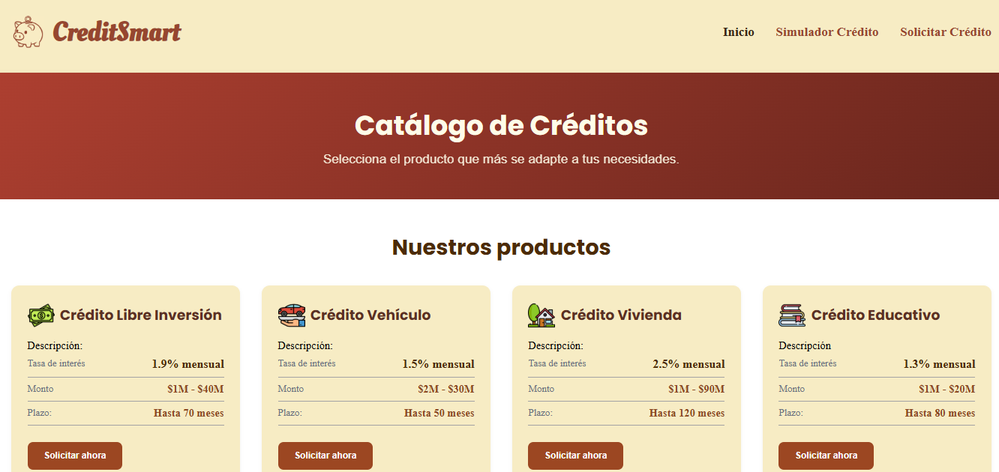
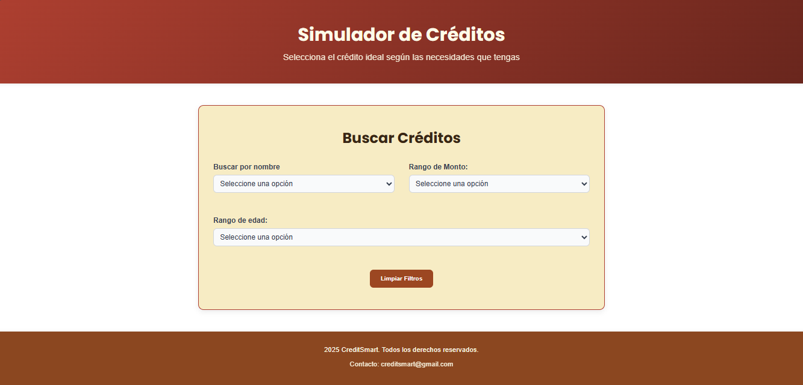

# CreditSmart_IngenieriaWeb1
**Estudiantes**
Isabela Blandón Vélez
Salome Molina Reyes
Angela Alean Acuña

**Descripción**
Este repositorio contiene las evidencias del curso Ingeniería Web I, desarrolladas a través del caso de estudio CreditSmart. Incluye estructura HTML, estilos CSS personalizados, diseño semántico y componentes visuales que reflejan buenas prácticas web.

**Estructura de archivos**
/interfacesweb_CreditSmart
│
|── CSS
|  |──style.css
|── img
|  |──agropecuario.png
|  |──educativo.png
|  |──empresarial.png
|  |──libreInversion.png
|  |──Simulador_pagina.png
|  |──SolicitudCredito_pagina.png
|  |──vehiculo.png
|  |──vivienda.png
|── index.html
|── README.md
|── simulador.html
└── solicitar.html

---

### **Instrucciones para ejecutar el proyecto**

1. Descargar o clonar el repositorio.
2. Mantener la estructura de carpetas como está.
3. Abrir el archivo **index.html** en cualquier navegador web.

---

### **Capturas de pantalla**

#### Página principal (index.html)

#### Simulador de crédito (simulador.html)

#### Solicitar crédito (solicitar.html)

---

